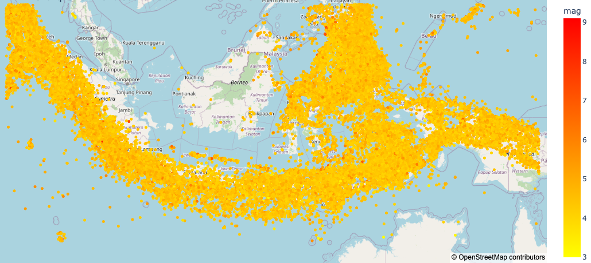

# Indonesian Earthquake Dataset (2000-2025)


## Overview

This repository contains a comprehensive dataset of earthquakes around the Indonesian region from January 1, 2000, to July 3, 2025. The dataset focuses on earthquakes with a magnitude of 3.0 or higher.



## Dataset Information

- **Source**: United States Geological Survey (USGS)
- **Geographic Coverage**: Indonesian region and surrounding areas
  - Longitude: 92° to 144° East
  - Latitude: -14° to 9° North/South
- **Time Period**: January 1, 2000 - July 3, 2025
- **Minimum Magnitude**: 3.0
- **Total Records**: 59,571 earthquakes

## Repository Structure

```
/
├── data/
│   ├── [Clean]_2000-7_3_2025_Indonesian_Earthquake_Data_mag3+.csv
│   ├── [Raw]_2000-2006_Indonesian_Earthquake_Data_mag3+.csv
│   ├── [Raw]_2007-2015_Indonesian_Earthquake_Data_mag3+.csv
│   ├── [Raw]_2016-2022_Indonesian_Earthquake_Data_mag3+.csv
│   └── [Raw]_2023-7_3_2025_Indonesian_Earthquake_Data_mag3+.csv
├── notebook/
│   └── Exploratory_Data_Analysis.ipynb
├── LICENSE
└── README.md
```

## Data Dictionary

The cleaned dataset contains the following columns:

| # | Column | Description | Data Type | Non-Null Count |
|---|--------|-------------|-----------|----------------|
| 0 | id | Unique identifier for the event | object | 59,570 |
| 1 | event_date | Date of earthquake occurrence | object | 59,570 |
| 2 | event_time | Time of earthquake occurrence | object | 59,570 |
| 3 | latitude | Latitude coordinate | float64 | 59,570 |
| 4 | longitude | Longitude coordinate | float64 | 59,570 |
| 5 | depth | Depth of earthquake (km) | float64 | 59,570 |
| 6 | magnitude | Magnitude | float64 | 59,570 |
| 7 | magnitude_type | Magnitude scale type (e.g., mb, ml, mww) | object | 59,570 |
| 8 | place | Textual description of the event's location | object | 59,570 |
| 9 | nst | Number of stations that reported P- and S-arrival times | float64 | 59,570 |
| 10 | gap | Largest azimuthal gap between azimuthally adjacent stations (degrees) | float64 | 59,570 |
| 11 | dmin | Horizontal distance from the epicenter to the nearest station (degrees) | float64 | 59,570 |
| 12 | rms | Root mean square of travel time residuals | float64 | 59,570 |
| 13 | net | Network that contributed the preferred origin | object | 59,570 |
| 14 | update_date | Date when the event was most recently updated | object | 59,570 |
| 15 | update_time | Time when the event was most recently updated | object | 59,570 |
| 16 | horizontal_error | Horizontal uncertainty of the location (km) | float64 | 59,570 |
| 17 | depth_error | Uncertainty of the depth (km) | float64 | 59,570 |
| 18 | magnitude_error | Uncertainty of the magnitude | float64 | 59,570 |
| 19 | magnirude_nst | Number of stations used to calculate the magnitude | float64 | 59,570 |
| 20 | location_source | Network that contributed the preferred location | object | 59,570 |
| 21 | mangnitude_source | Network that contributed the preferred magnitude | object | 59,570 |


## Data Processing

The following data processing steps were performed:

1. **Data Collection**: Raw data was downloaded from USGS and split into four time periods due to size constraints.
2. **Data Merging**: All raw datasets were merged into a single comprehensive dataset.
3. **Exploratory Data Analysis**:
   - Statistical analysis of the data
   - Removal of duplicate records
   - Handling of missing values based on column requirements
   - Conversion of string datetime information to proper format
   - Detection and handling of outliers
   - Resolution of inconsistent data
4. **Data Transformation**: Reorganization of columns in a logical order
5. **Data Export**: Creation of a clean, ready-to-use CSV file

## Usage

The clean dataset can be used for:
- Visualization of earthquake patterns in the Indonesian region
- Analysis of seismic activity over time
- Research on correlation between earthquake parameters
- Documentation of seismic history
- Further statistical analysis or machine learning applications

## Getting Started

### Prerequisites
- Python 3.x
- Pandas
- NumPy
- Matplotlib
- Seaborn

### Example Code
```python
import pandas as pd
import matplotlib.pyplot as plt
import seaborn as sns

# Load the clean dataset
earthquake_data = pd.read_csv('data/[Clean]_2000-7_3_2025_Indonesian_Earthquake_Data_mag3+.csv')

# Display basic information
print(earthquake_data.info())
print(earthquake_data.describe())

# Visualize earthquake magnitudes over time
plt.figure(figsize=(15, 6))
plt.scatter(pd.to_datetime(earthquake_data['time']), 
            earthquake_data['mag'], 
            alpha=0.5, 
            s=earthquake_data['mag']**2, 
            c=earthquake_data['depth'], 
            cmap='viridis')
plt.colorbar(label='Depth (km)')
plt.title('Earthquake Magnitudes in Indonesia (2000-2025)')
plt.xlabel('Date')
plt.ylabel('Magnitude')
plt.grid(True, alpha=0.3)
plt.show()
```

## License

This project is licensed under the [LICENSE](LICENSE) - see the file for details.

## Acknowledgments

- United States Geological Survey (USGS) for providing the raw earthquake data
- All contributors to this project
